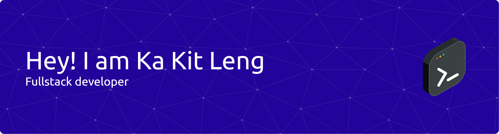

  

---

Located: Michigan, United States  
From: Kuala Lumpur, Malaysia

I'm passionate about creating applications to improve people's daily life. I aspire to push the limit of human innovation and give people an opportunity to learn and create through coding. I hope to create an environment for people to go out of their comfort zone and contribute to the tech industry.

---
## Tech Stack

### Languages

### Frontend Frameworks & Libraries

### Backend Frameworks & Libraries

### Styling & Markup

### Databases

### Enterprise Software

### Cloud & DevOps

---

## GitHub Statistics

  

---

## Contribution Graph

  

